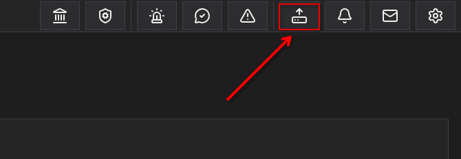
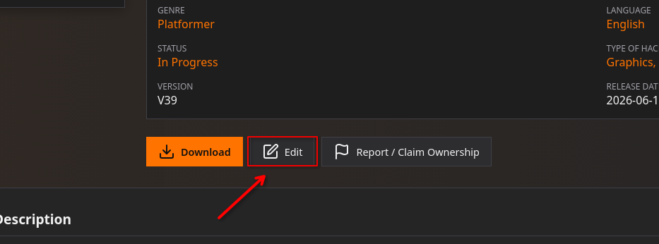

# Submit or edit an entry

## Submit an entry

If you want to submit an entry, you can click the “Submit” button in the top bar. If you don't see the button, make sure you're logged in and that you haven't been restricted from using the site.

Next, you can choose the type of entry you'd like to submit.
**Please note: The tutorials have been moved to the forum.** If you'd like to submit one, please do so on the forum.

After selecting the type of entry you want to submit, you can fill out the various fields.

Some details about the fields:

- For translations, the title of an entry is not required. The game's title will be used by default, but if you have a title that differs from the original game, you can enter it in the “Custom title” field.
- The description field uses Markdown.
- For games, first check to see if your game already exists with the correct title and platform; if not, click “Add a game” to create a new entry.
- For the “Hashes” field, you must upload your original ROM (unmodified); it is no longer possible to fill in this field manually.
- In the “Gallery” field, you can reorder the entries however you like.
- Authors are the people who created the content—such as the creators of the ROM hack, the translation, etc. If you are one of them, add yourself. Same principle as for the “Games” field: if you can’t find the author, you can add them using the “Add an author” button.
- Checking the “NSFW” box for an entry will hide it from guests and users who haven’t checked “Enable NSFW entries” in their profile settings.

## Submit state

Depending on your role, you have different options for submitting your post.

- Save to my drafts: This means you are the only one who can see this entry; it will go to the “My drafts” page, and you can continue working on it later. (An entry in draft mode does not require all fields to be filled out to be saved; only a few fields are mandatory, such as the title, version, release date, and status.)

- Add to submissions queue: The entry will go into the queue and will be reviewed by a staff member with the necessary permissions. It may be approved or rejected. (More details below)

- Publish it now: The entry will be published directly on the site. To have this option, you must be a verified member.

## Submissions Queue

If you have submitted your entry to the queue, it will be reviewed by a staff member.
The person reviewing the entry may leave a comment on it. They may also approve it—meaning it will become public on the site—or reject it.

In either case, you will receive a message.

If your entry has been rejected, an explanation will be provided in the message. You will then have 7 days to edit it and resubmit it; after that, it will be deleted.

If you have edited the entry several times and it still does not meet the platform’s requirements, your entry will be locked, and you may receive a warning.

## Edit an entry

If you want to edit an entry, go to the entry's page and click “Edit.”

From there, you can edit your entry, and you can also modify information about your files.
- You can change the status of your files to:
  - Public: Anyone can download it
  - Private: Only you can download it
  - Archived: The file is archived; you can no longer edit it, but anyone can download it.
- You can enable the online patcher if your entry supports it, as well as the “Play online” option.
You can also request that your entry be featured for 15 days by clicking the “Featured” button at the bottom of the entry.

If you edit the “version” field, the entry's publication date will be updated to “now.”

Any changes made to the entry must be saved by clicking the “Submit” button.