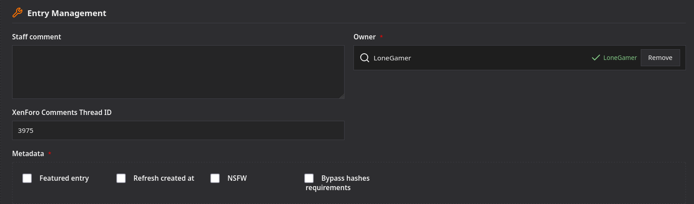
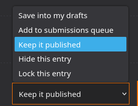
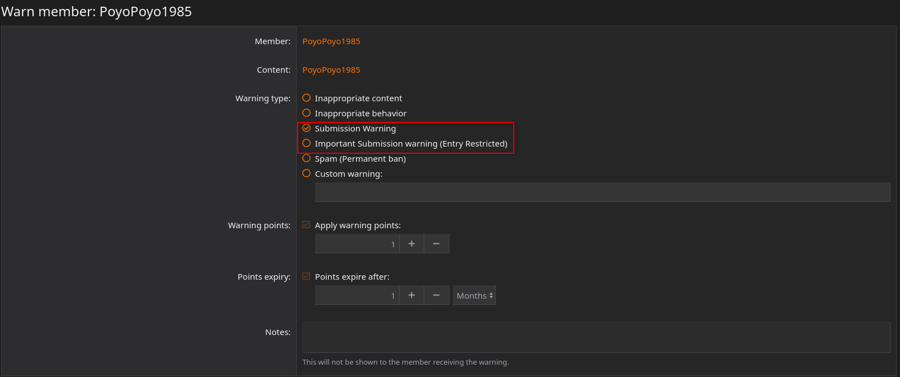
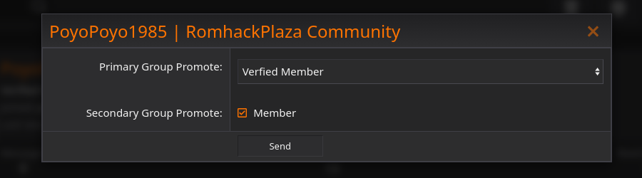

# Manage entries

If you have “Entries manager” permissions, you can edit all entries and manage the entry queue.

## Managing Entries

On every entry, you’ll see an “Edit” button to edit the entry.
You have the same options as if it were your own entry, but with the added “Entry Management” section. There, you can:

- Write a staff comment for staff who view the entry.
- Change the entry’s owner.
- Change the ID of the XenForo thread that serves as the comment section.
- Manually mark the entry as “Featured” for 15 days.
- Update the entry’s publication date without changing the version number.
- Mark the entry as NSFW, or unmark it.
- Ignore hash checks if any hashes are missing from the entry.

You also have the option to change the entry's submission status. Depending on your permissions, you will also have two new statuses:

- Hide this entry: The entry is hidden from everyone except administrators.
- Lock this entry: The entry is hidden from everyone except staff; this status is used if you want to prevent a member from editing this entry after multiple submissions.

## Managing the Submissions Queue

All entries in the queue must be processed by staff. A new entry appears as follows:

- You can view and edit the entry.
- You can write a comment for other staff members. (This comment is also visible to other users.)
- You can approve or reject the entry.

If you approve the entry, it will be removed from the queue and made public on the site.
If you reject the entry, you must provide a reason. Once rejected, you can no longer view it without the necessary permissions. It will remain in the queue until:

- 7 days have passed, at which point it will be automatically deleted
- The entry’s owner marks it as a draft or reposts it.

## If someone breaks the rules multiple times.

If someone breaks the rules multiple times, you can:

1. Set their post to “Locked” so they can no longer edit it.
2. Give them a warning, or contact another staff member to have them issue a warning.

To issue a warning, go to their user profile and click “Warn.” You can then select from two types of warnings:

- Submission Warning: 1 warning point; the point expires after 1 month. This is a gentle reminder.
- Important Submission Warning: 2 warning points; the points expire after 1 month. The user will no longer be able to post entries on the site without contacting a staff member.

## Marking a User as Verified

If you want to mark a member as verified, you have two options:

- If the person is well-known in the romhacking scene and creates their own romhacks, you can use the “Promote” option on their profile to mark them as verified.  (Be sure to check “Member” as well to avoid permission issues.)

- If the person is a regular user, they will be automatically promoted after submitting 10 public entries.