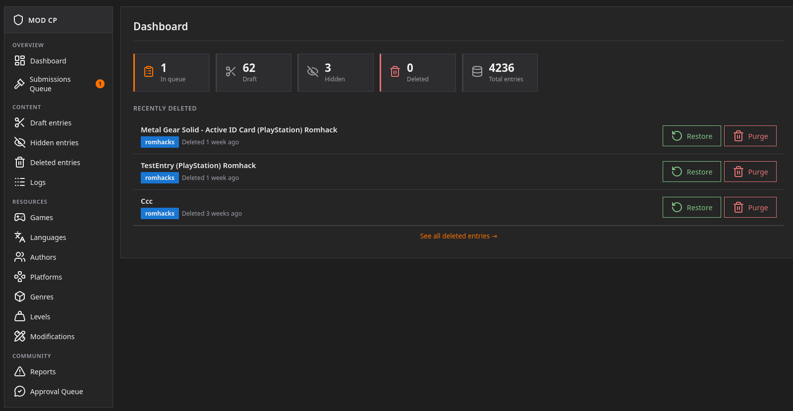

# Mod CP

As a moderator, you have access to the modCP, which allows you to manage various tasks.

## Dashboard

You can view a summary of all entries submitted to the site, the most recently deleted entries, and more.

## Submissions queue

This is a shortcut to the Submissions Queue.

## Locked entries

Allows you to view a list of all entries that have been marked as locked.

## Draft entries (Admin)

Allows you to view a list of all drafts.

## Hidden entries

Allows you to view a list of all hidden entries.

## Deleted entries

Allows you to view all “soft-deleted” entries—those deleted after 30 days without any changes.

## Logs

Allows you to view the logs of changes made to entries.

## Resources

Allows you to edit data such as games, authors, languages, etc. You can also add new data.

## Reports

All reports regarding entries, threads, and messages will go here.

## Approval queue

All requests awaiting approval other than entries. (Featured requests, club requests, messages pending approval,

